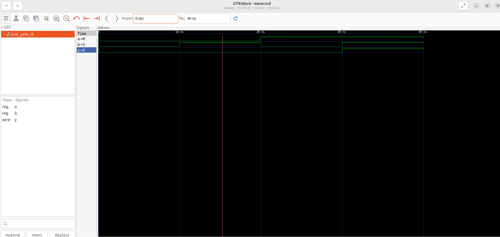

# AND Gate using Verilog HDL

## Overview

This project implements and verifies a 2-input AND gate using Verilog HDL.

## Tools Used

- Verilog HDL
- Icarus Verilog
- GTKWave
- Ubuntu Linux

## Files

- and_gate.v
- and_gate_tb.v

## Truth Table

| A | B | Y |
|---|---|---|
|0|0|0|
|0|1|0|
|1|0|0|
|1|1|1|

## Simulation Waveform

