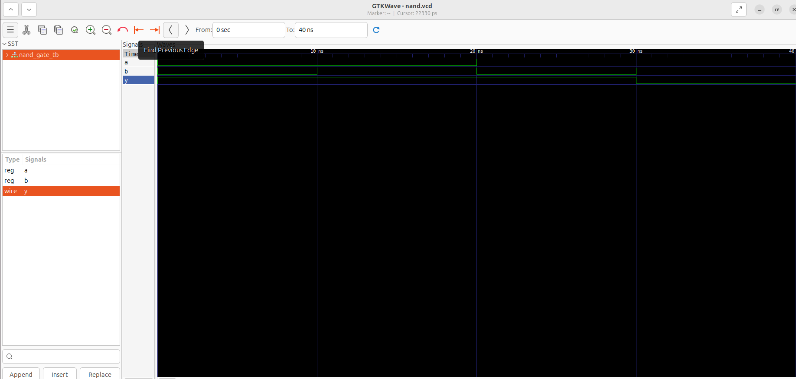

# NAND Gate using Verilog

This is my fourth Verilog project. In this project, I designed a 2-input NAND gate, wrote a testbench to verify its functionality, and observed the output waveform using GTKWave.

## Files

* `nand_gate.v` – NAND gate design
* `nand_gate_tb.v` – Testbench
* `nand_gate_waveform.png` – Output waveform
* `README.md` – Project documentation

## Truth Table

| A | B | Y |
| - | - | - |
| 0 | 0 | 1 |
| 0 | 1 | 1 |
| 1 | 0 | 1 |
| 1 | 1 | 0 |

## Simulation Commands

Compile:

```bash
iverilog -o nand nand_gate.v nand_gate_tb.v
```

Run:

```bash
vvp nand
```

View Waveform:

```bash
gtkwave nand.vcd
```

## Output Waveform



## What I Learned

* Learned how to implement a 2-input NAND gate using Verilog HDL.
* Understood the use of the bitwise NOT (`~`) and AND (`&`) operators together.
* Wrote a testbench to verify all possible input combinations.
* Simulated the design using Icarus Verilog.
* Verified the output waveform using GTKWave.
* Improved my Git and GitHub workflow by documenting and uploading the project.

